# Project Plots — Visual Analysis Guide

This document walks through every plot generated during the exploration, feature engineering, and model training phases of the Musical Mood Classifier. Each plot is explained in plain terms — what it shows, why it was created, and what conclusion was drawn from it.

---

## Table of Contents

1. [Exploratory Data Analysis (EDA)](#1-exploratory-data-analysis-eda)
   - [Waveforms by Mood](#11-waveforms-by-mood)
   - [Mel Spectrograms by Mood](#12-mel-spectrograms-by-mood)
   - [Box Plots — Feature Distributions by Mood](#13-box-plots--feature-distributions-by-mood)
   - [Violin Plots — Key Features by Mood](#14-violin-plots--key-features-by-mood)
   - [ANOVA Feature Importance](#15-anova-feature-importance)
   - [Feature Correlation Matrix](#16-feature-correlation-matrix)
   - [PCA — 2D Projection](#17-pca--2d-projection)
   - [t-SNE — 2D Projection](#18-t-sne--2d-projection)
2. [Feature Visualizations](#2-feature-visualizations)
   - [MFCCs by Mood](#21-mfccs-by-mood)
   - [Chroma Features by Mood](#22-chroma-features-by-mood)
3. [Model Results](#3-model-results)
   - [Model Comparison](#31-model-comparison)
   - [Confusion Matrix — SVM](#32-confusion-matrix--svm)
   - [Confusion Matrix — Random Forest](#33-confusion-matrix--random-forest)
   - [Confusion Matrix — XGBoost](#34-confusion-matrix--xgboost)
   - [All Three Confusion Matrices Side by Side](#35-all-three-confusion-matrices-side-by-side)
   - [Feature Importance — Random Forest (from model.py)](#36-feature-importance--random-forest-from-modelpy)
   - [Feature Importance — XGBoost (from model.py)](#37-feature-importance--xgboost-from-modelpy)
   - [Feature Importance — Random Forest (from notebooks)](#38-feature-importance--random-forest-from-notebooks)

---

## 1. Exploratory Data Analysis (EDA)

EDA is the first step in any ML project. Before training any model, we look at the raw data visually to understand its structure, spot patterns, and check if the features are actually useful for distinguishing between classes.

---

### 1.1 Waveforms by Mood

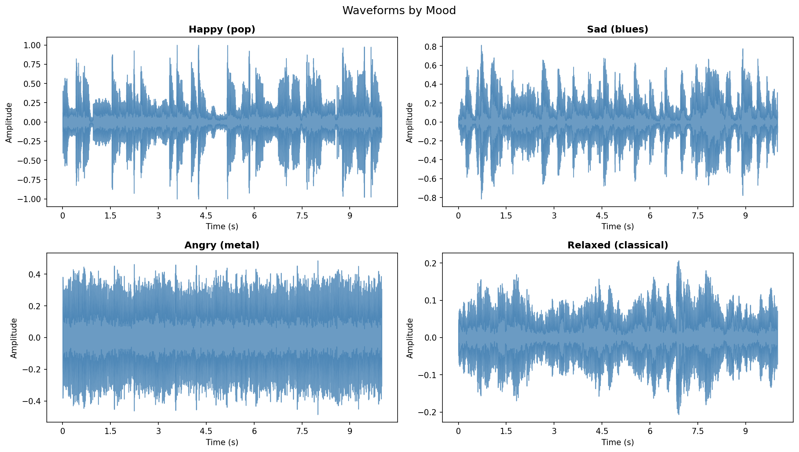

**What this is:** A waveform is a direct plot of the audio signal — the x-axis is time (in seconds) and the y-axis is amplitude (how loud the sound is at each moment). This is the rawest possible view of an audio file.

**What we plotted:** One representative song from each mood: Happy (pop), Sad (blues), Angry (metal), and Relaxed (classical).

**What we can see:**

- **Happy (pop):** The waveform is dense and consistently loud throughout. The amplitude stays near maximum the whole time — this is the effect of modern music production (called "loudness wars") where pop songs are compressed to be loud from start to finish.

- **Sad (blues):** The waveform has more variation. You can see natural dynamics — louder and quieter sections. Blues music breathes; it doesn't stay at maximum volume the entire time.

- **Angry (metal):** The waveform appears "squashed" — a narrow band of moderate amplitude throughout. This is because metal guitar distortion creates a wall of sound that saturates the signal. The amplitude variation within the signal is low despite being perceptually very loud.

- **Relaxed (classical):** The waveform shows the most variation by far — very quiet passages followed by louder ones. Classical music is composed with intentional dynamic range, which is the opposite of compressed pop.

**Conclusion drawn:** Waveforms alone can give us a rough sense of dynamics and energy. The RMS energy feature in our model captures this directly. Classical and blues have high dynamic variation (high RMS std); pop has low variation (low RMS std).

---

### 1.2 Mel Spectrograms by Mood

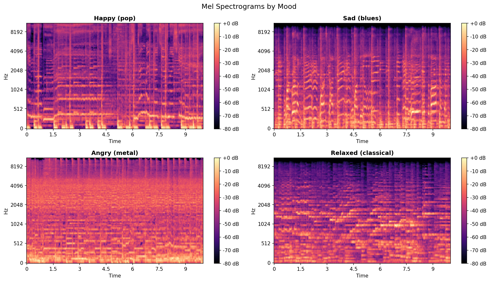

**What this is:** A spectrogram shows how the frequency content of a song changes over time. The x-axis is time, the y-axis is frequency (in Hz on a mel scale), and the color represents intensity — brighter/warmer = louder at that frequency at that time. The mel scale compresses high frequencies to match human hearing perception.

**What we plotted:** Same four moods — Happy (pop), Sad (blues), Angry (metal), Relaxed (classical).

**What we can see:**

- **Happy (pop):** The spectrogram is bright and warm across a wide range of frequencies, and it stays consistent throughout. Strong energy in mid and high frequencies. This gives pop its bright, full sound.

- **Sad (blues):** Compared to pop, the upper frequency range (above ~4000 Hz) is noticeably darker/cooler. The energy is more concentrated in lower-mid frequencies. Blues instruments (guitar, harmonica, piano) produce warm, mid-heavy sounds.

- **Angry (metal):** This is the most visually distinctive. The entire spectrogram is uniformly bright — high energy across ALL frequencies from very low to very high. This is the effect of distorted electric guitars which produce harmonics across the full frequency spectrum. The uniform brightness is a key differentiator for the Angry class.

- **Relaxed (classical):** The most structured pattern. You can see clear horizontal bands of energy (individual instrument notes) against a dark background. Classical music has a lot of silence between notes and clear tonal structure. Much darker in the very high frequencies compared to pop or metal.

**Conclusion drawn:** The spectral contrast features in our model (which measure the difference between spectral peaks and valleys) directly capture this difference. Metal has low contrast (uniformly loud), while classical has high contrast (clear peaks against silence).

---

### 1.3 Box Plots — Feature Distributions by Mood

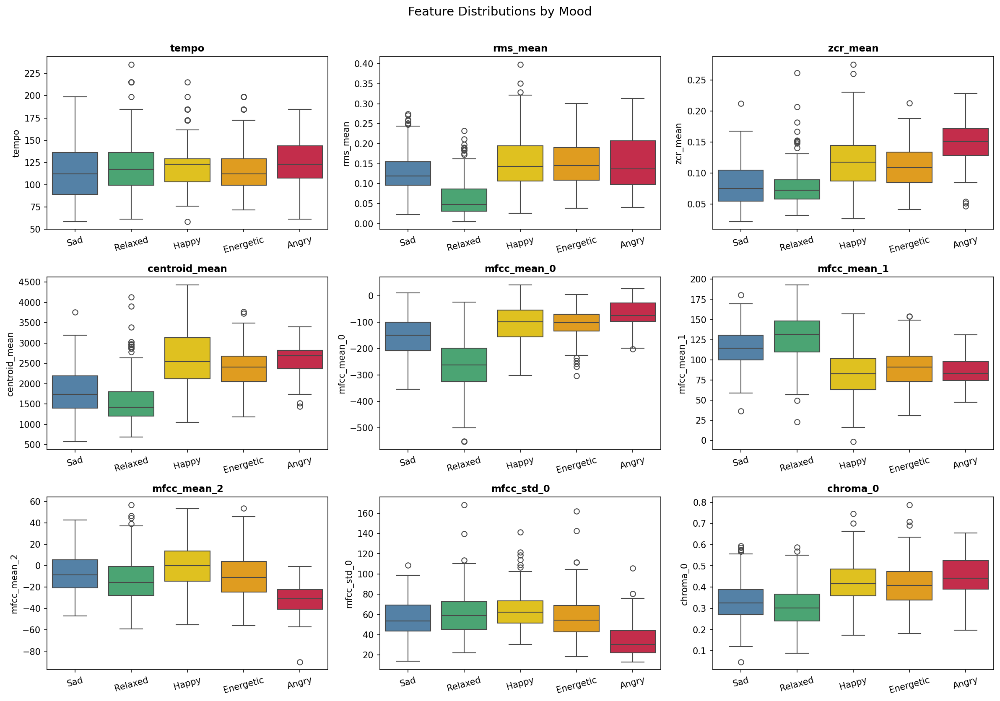

**What this is:** A box plot shows the statistical distribution of a feature across songs of each mood. The box spans the 25th to 75th percentile (the middle 50% of values). The line in the middle is the median. The whiskers extend to the min/max (excluding outliers). Dots are outliers.

**What we plotted:** 9 of the most important features: tempo, rms_mean, zcr_mean, centroid_mean, mfcc_mean_0, mfcc_mean_1, mfcc_mean_2, mfcc_std_0, chroma_0.

**What we can see:**

- **Tempo:** Angry (metal) has a noticeably higher median tempo than Sad and Relaxed, but overlaps significantly with Happy and Energetic. Tempo alone is not enough to separate moods.

- **RMS Mean (loudness):** Happy and Energetic songs are clearly louder (higher RMS) than Relaxed. This is a strong separator.

- **ZCR Mean (zero crossing rate):** Angry (metal) has a distinctly higher ZCR than all other moods, especially compared to Relaxed. This makes sense — distorted guitar crosses zero much more frequently than a piano or violin.

- **Centroid Mean (brightness):** Energetic and Happy songs have higher spectral centroids (brighter sound) compared to Sad and Relaxed.

- **MFCC Mean 0:** Shows a clear separation — this is the most powerful MFCC coefficient for mood classification. Angry (metal) sits at a very different range from Relaxed (classical).

**Conclusion drawn:** No single feature perfectly separates all 5 moods, but each feature contributes partial information. The ML model combines all 56 features simultaneously to make a final decision — something no single plot can do.

---

### 1.4 Violin Plots — Key Features by Mood

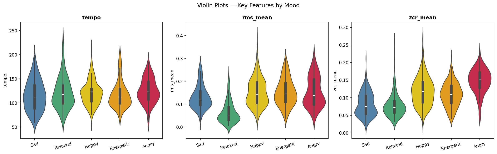

**What this is:** A violin plot is an enhanced box plot. The width of the violin at any point shows how many songs have that value — a wider section means more songs clustered at that value. It gives a better picture of the full distribution shape than a box plot.

**What we plotted:** Three key features — tempo, rms_mean, zcr_mean — across all 5 moods.

**What we can see:**

- **Tempo:** All moods have a similar spread of tempos (roughly 80–200 BPM), with Sad having slightly more songs at slower tempos (the violin is wider at the bottom). The distributions overlap heavily — tempo alone would be a poor classifier.

- **RMS Mean:** Very clear separation here. Relaxed songs cluster tightly at low RMS values (narrow violin near the bottom). Happy and Energetic spread toward higher values. The violin shapes are distinctly different — this confirms RMS is a useful feature.

- **ZCR Mean:** Angry (metal) has a dramatically different violin shape — it has a high density of songs with elevated ZCR. Relaxed has a narrow violin at very low values. This confirms that zero crossing rate is one of the most discriminative features for detecting the Angry class.

**Conclusion drawn:** Violin plots confirmed that RMS and ZCR are the two time-domain features most worth including. The tempo feature shows high overlap between classes, meaning the model shouldn't rely on it too heavily.

---

### 1.5 ANOVA Feature Importance

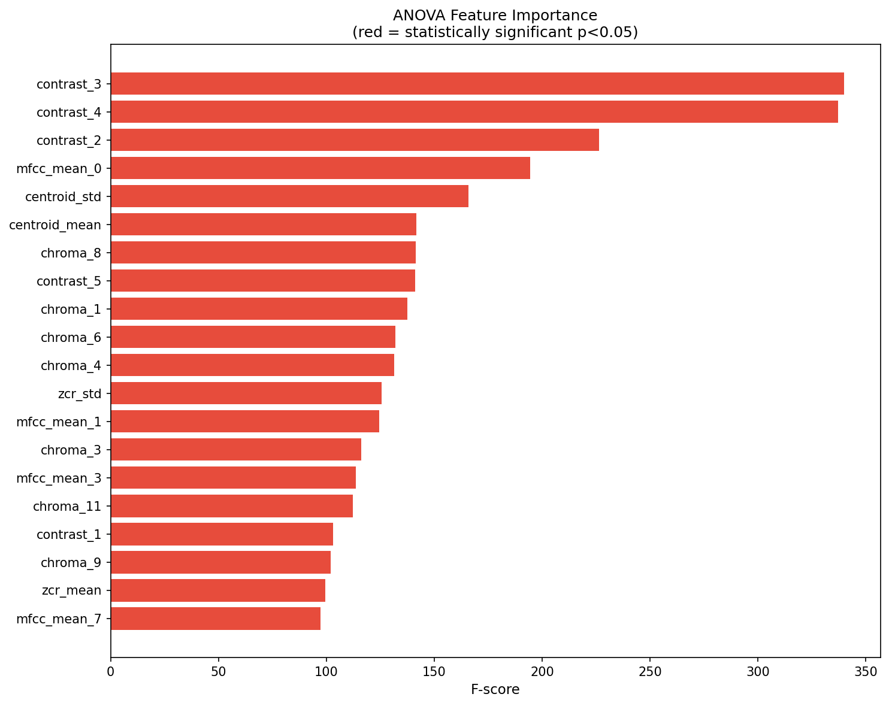

**What this is:** ANOVA (Analysis of Variance) is a statistical test that answers: "Is the mean of this feature significantly different across the 5 mood classes?" A high F-score means yes — the feature varies a lot between classes relative to how much it varies within a class. Red bars indicate the feature is statistically significant (p < 0.05), meaning the difference is very unlikely to be due to random chance.

**What we plotted:** The top 20 features ranked by their ANOVA F-score. All bars are red because all pass the significance test.

**What we can see:**

- **contrast_3 and contrast_4** are the top two features by a wide margin (F-score ~340). These are the spectral contrast values in the mid-to-high frequency bands — they best distinguish between moods.

- **contrast_2** comes in third (~225). Multiple spectral contrast features dominate the top of the list.

- **mfcc_mean_0** at rank 4 (~195) — the first MFCC coefficient is the most powerful individual MFCC.

- **centroid_std** at rank 5 (~165) — how much the brightness varies over time is highly discriminative.

- Chroma features (chroma_1, chroma_4, chroma_6, chroma_8) also appear consistently in the top 20.

- **tempo** does not appear in the top 20, confirming the violin plot finding that tempo is not very discriminative on its own.

**Conclusion drawn:** Spectral contrast features are the single most statistically powerful group for mood classification, followed by MFCCs and chroma. This guided which features to prioritize and validated that all 56 features we chose are statistically meaningful.

---

### 1.6 Feature Correlation Matrix

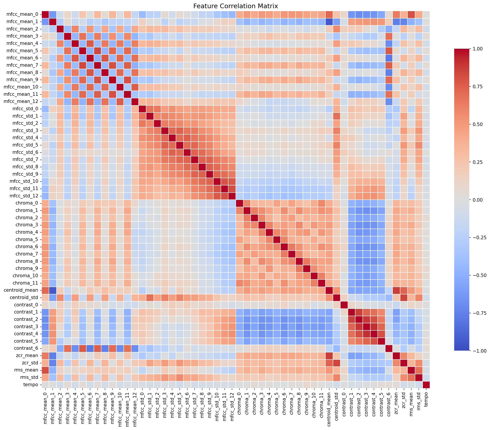

**What this is:** A heatmap showing the pairwise correlation between all 56 features. Red = strong positive correlation (when one goes up, the other goes up). Blue = strong negative correlation (when one goes up, the other goes down). White/pale = no correlation.

**What we can see:**

- **MFCC means (top-left block):** Strong positive correlations within the MFCC mean group — the 13 coefficients are correlated with each other because they all describe the same spectrum.

- **MFCC stds (second block):** Similarly correlated within themselves.

- **Chroma features (middle block):** The 12 chroma features show moderate positive correlations with each other — if a song has energy in one pitch class, nearby pitch classes tend to have energy too.

- **Contrast features:** Show strong positive correlations with each other and interestingly have **negative correlations** with some MFCC features. This means songs with high spectral contrast tend to have lower MFCC values in certain coefficients — which aligns with metal (high contrast due to distortion) having a different tonal texture than classical.

- **RMS mean and ZCR mean** (bottom-right area): Show relatively low correlation with most other features, meaning they provide independent information not captured by MFCCs or chroma.

**Conclusion drawn:** There is some redundancy in the features (correlated MFCC coefficients), but the overall feature set covers diverse aspects of the audio. We chose not to remove correlated features because SVM with RBF kernel can handle high-dimensional correlated inputs, and removing features would risk losing information.

---

### 1.7 PCA — 2D Projection

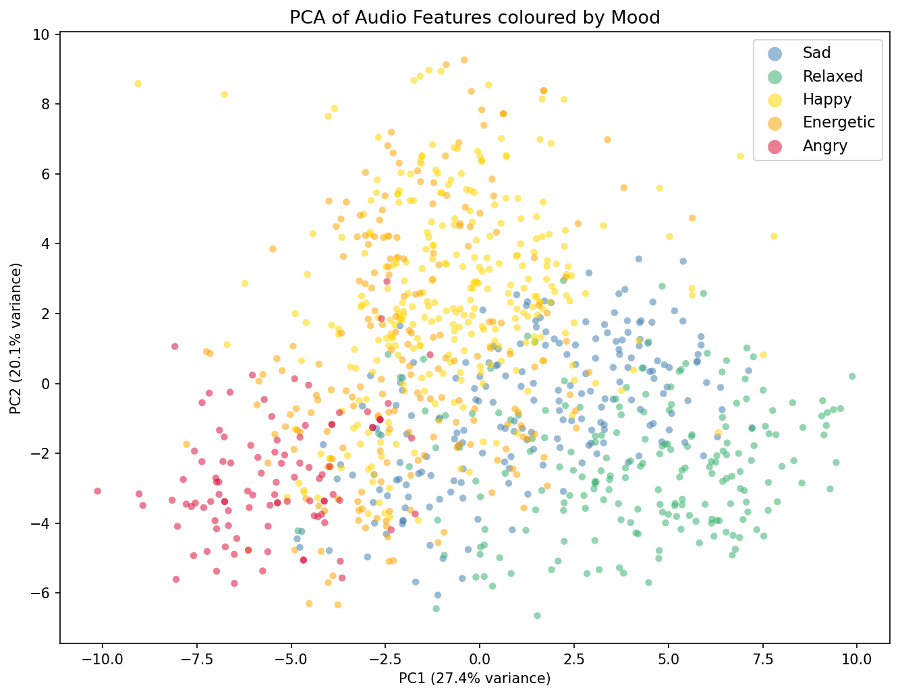

**What this is:** PCA (Principal Component Analysis) is a dimensionality reduction technique. It takes all 56 features and compresses them into 2 numbers (PC1 and PC2) that capture as much variance as possible. PC1 captures 27.4% of the total variance; PC2 captures 20.1%. Each dot is one song, coloured by its mood.

**What we can see:**

- The 5 moods are **not cleanly separated** in 2D PCA space. The clusters overlap significantly.

- **Relaxed (blue/teal)** has the most distinct cluster — it sits in the upper-left region, away from the others. This makes sense: classical and jazz are acoustically very different from pop, rock, or metal.

- **Happy (yellow) and Energetic (orange)** overlap heavily in the center-right region — they share similar energy and spectral characteristics, making them the hardest pair to separate.

- **Angry (pink/red)** dots are scattered but tend to appear in a different region from Relaxed.

- **Sad (blue)** overlaps with most other classes.

**Conclusion drawn:** The mood classes are not linearly separable in 2D. This tells us two things: (1) we need a non-linear classifier (like SVM with RBF kernel, or tree-based models), and (2) 56 dimensions capture much more information than 2 — the overlap we see in PCA would be less in the full 56D space. The poor 2D separation did NOT discourage us from building the model.

---

### 1.8 t-SNE — 2D Projection

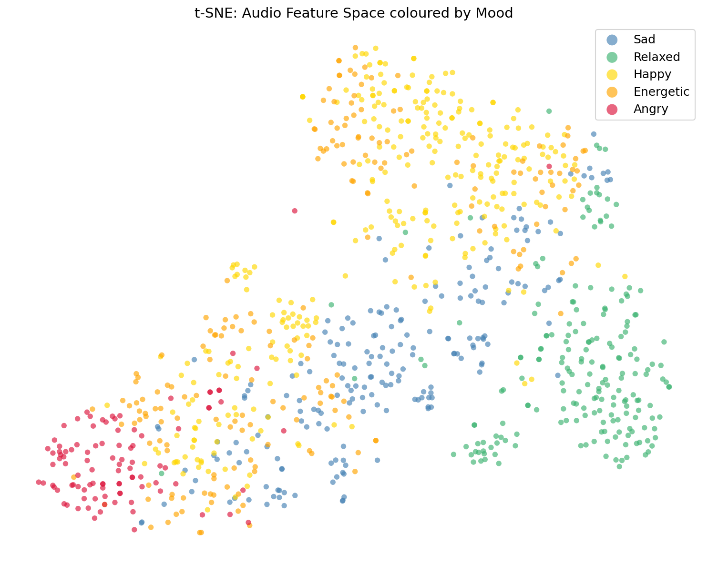

**What this is:** t-SNE (t-distributed Stochastic Neighbor Embedding) is a more powerful dimensionality reduction technique than PCA. Unlike PCA which preserves global variance, t-SNE preserves local neighborhood structure — it places similar songs near each other. This makes it better at revealing natural clusters.

**What we can see:**

- **Much clearer cluster separation than PCA.** The moods form more distinct islands in t-SNE space.

- **Relaxed (green)** forms a tight, well-separated cluster in the upper-right. This confirms that Relaxed songs (classical, jazz) have a very consistent and unique audio fingerprint.

- **Angry (red/pink)** forms a small but distinct cluster in the bottom-left, clearly separated from the others. This is encouraging — it means the Angry class IS learnable, the model just needs enough training examples.

- **Happy (yellow) and Energetic (orange)** still overlap, but t-SNE shows that within the overlap, there are sub-clusters — meaning some Happy songs are acoustically very different from some Energetic songs, but the boundary is gradual not sharp.

- **Sad (blue)** spreads across a wider area, overlapping with Happy and Relaxed in some regions.

**Conclusion drawn:** t-SNE confirms that the mood classes have genuine structure in the feature space. The separation is not perfect (expected, since mood is subjective), but it is real and learnable. The fact that Angry and Relaxed are the most separated clusters matches the model's results — these two classes have the highest precision and recall scores.

---

## 2. Feature Visualizations

---

### 2.1 MFCCs by Mood

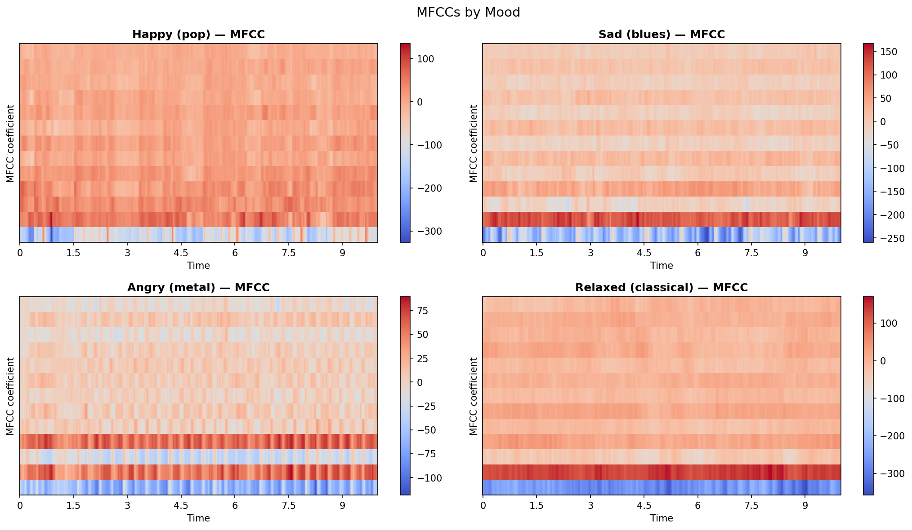

**What this is:** A heatmap showing the raw MFCC values over time for one representative song from each mood. The x-axis is time, the y-axis is MFCC coefficient number (1 to 13), and the color is the value of that coefficient at that moment. Red = high positive value, blue = high negative value.

**What we plotted:** Happy (pop), Sad (blues), Angry (metal), Relaxed (classical).

**What we can see:**

- **Happy (pop):** The MFCC heatmap is dominated by warm red tones, especially in the upper coefficients. The pattern is relatively uniform and stable over time — consistent tonal texture throughout the song.

- **Sad (blues):** Similar warmth in the upper coefficients, but the lower coefficients (bottom rows) show more blue — negative values — compared to pop. This indicates a darker, lower-frequency tonal character. The pattern varies more over time, reflecting the dynamic nature of blues.

- **Angry (metal):** Strikingly different from the others. There is much more blue (negative values) scattered throughout, especially in the middle coefficients. The pattern changes rapidly over time (high horizontal variability), reflecting the distorted, chaotic texture of metal. The high MFCC standard deviation features capture this rapid variation.

- **Relaxed (classical):** The most visually uniform. Stable warm tones in upper coefficients, with very consistent patterns over time. Classical music has predictable, structured harmonic content that doesn't change rapidly — resulting in low MFCC standard deviation values.

**Conclusion drawn:** The MFCC heatmaps visually confirm why both MFCC means AND standard deviations are included as features. The mean captures the average tonal color; the std captures how much that color fluctuates over time. Metal has high std; classical has low std.

---

### 2.2 Chroma Features by Mood

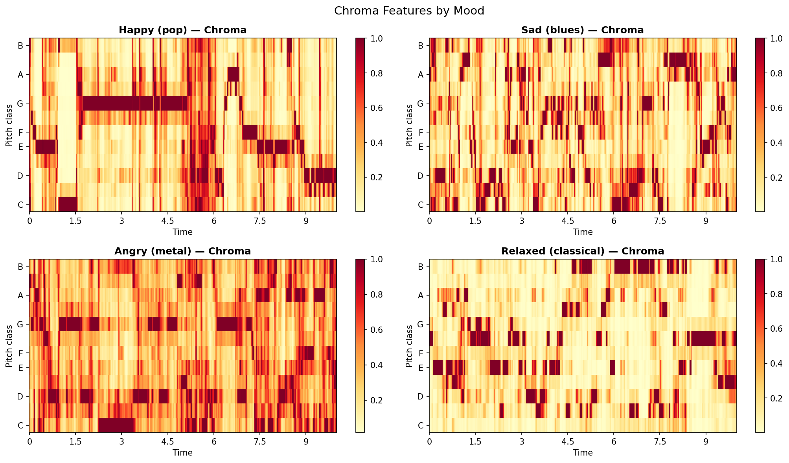

**What this is:** A chroma heatmap shows the energy in each of the 12 musical pitch classes (C, C#, D, D#, E, F, F#, G, G#, A, A#, B) over time. The x-axis is time, the y-axis is pitch class, and the color is the energy at each pitch class at each moment. Dark red = high energy at that pitch; pale yellow = low energy.

**What we plotted:** Happy (pop), Sad (blues), Angry (metal), Relaxed (classical).

**What we can see:**

- **Happy (pop):** Clear, well-defined chord structures. You can see specific pitch classes lighting up at specific times (the chord changes), with long stretches where one or two pitch classes (like G and E) dominate. This is the signature of structured pop chord progressions.

- **Sad (blues):** More spread of energy across multiple pitch classes at once, with less clearly defined individual chords. Blues music uses bends, slides, and blue notes that blur the pitch content across adjacent pitch classes.

- **Angry (metal):** The chroma is very diffuse — energy is spread across all 12 pitch classes somewhat uniformly at all times. This is because guitar distortion creates harmonics across all pitch classes, making the harmonic content hard to pin down. The chroma features look "muddy" compared to pop.

- **Relaxed (classical):** The most structured and clean chroma. Specific pitch classes activate clearly and hold for longer durations — you can almost see the individual notes being played. Very defined harmonic structure.

**Conclusion drawn:** The 12 chroma mean features capture how much each pitch class is used on average throughout a song. Pop uses concentrated pitch classes (major key harmony); metal spreads energy across all pitch classes (distortion effect); classical has clear but sparse pitch activation. These differences are exactly what the chroma features encode numerically.

---

## 3. Model Results

---

### 3.1 Model Comparison

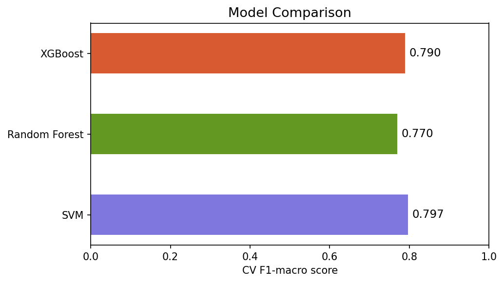

**What this is:** A horizontal bar chart comparing the cross-validation F1-macro scores of the three trained models.

**What it shows:**

| Model | CV F1-macro |
|---|---|
| SVM | 0.797 |
| XGBoost | 0.790 |
| Random Forest | 0.770 |

**What each number means:** F1-macro is the average F1 score across all 5 mood classes, treating each class equally regardless of how many samples it has. A score of 0.797 means the model correctly identifies moods about 80% of the time with balanced performance across all classes.

**Why F1-macro and not accuracy?** The dataset is imbalanced — Happy has 300 samples but Angry has only 100. A model could get 81% accuracy by mostly predicting Happy and never predicting Angry. F1-macro penalizes this behavior by measuring how well each class is handled independently.

**Why is SVM best?** SVM with an RBF kernel finds the maximum-margin boundary between classes in high-dimensional space. With 56 carefully engineered audio features (not raw pixels or text), SVM works excellently because the features are already a good, dense representation of the signal. Tree-based models like XGBoost and Random Forest need more data to reach their potential.

**Conclusion drawn:** All three models perform similarly (within 3% of each other), which is a good sign — it means the feature engineering is solid. SVM was selected as the final model and saved to `model.pkl`.

---

### 3.2 Confusion Matrix — SVM

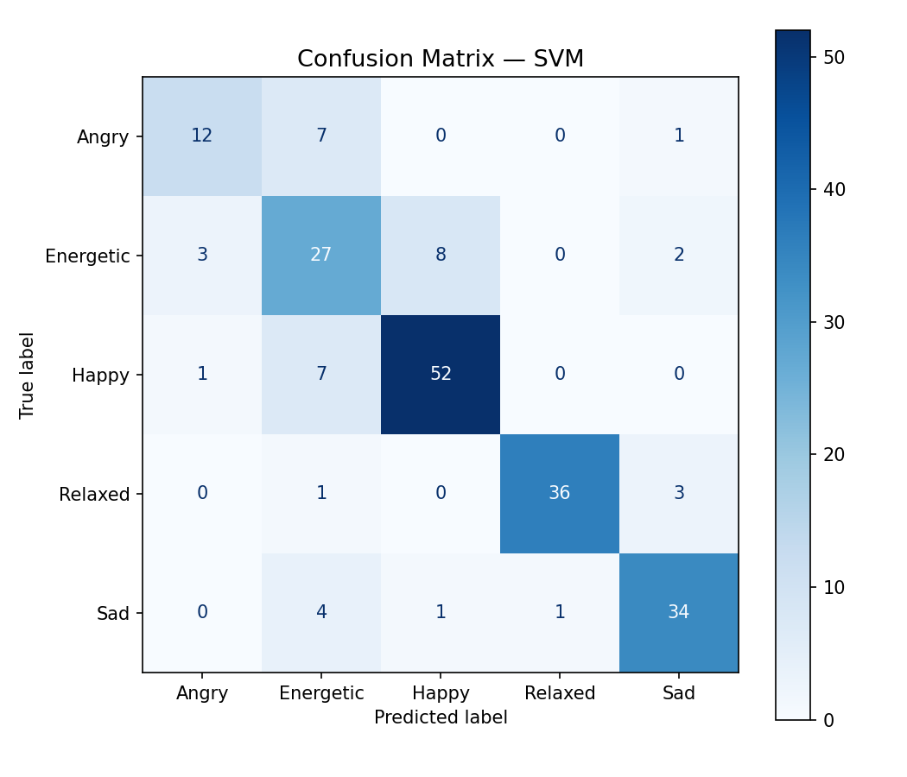

**What this is:** A confusion matrix shows exactly where the model makes mistakes. Each row is the true mood of the song; each column is what the model predicted. The diagonal (top-left to bottom-right) shows correct predictions. Everything off the diagonal is an error. Darker blue = more predictions in that cell.

**Reading the numbers (200 test songs total):**

| True → Predicted | Angry | Energetic | Happy | Relaxed | Sad | Total | Correct |
|---|---|---|---|---|---|---|---|
| **Angry** | **12** | 7 | 0 | 0 | 1 | 20 | 60% |
| **Energetic** | 3 | **27** | 8 | 0 | 2 | 40 | 68% |
| **Happy** | 1 | 7 | **52** | 0 | 0 | 60 | 87% |
| **Relaxed** | 0 | 1 | 0 | **36** | 3 | 40 | 90% |
| **Sad** | 0 | 4 | 1 | 1 | **34** | 40 | 85% |

**Key observations:**

- **Angry is the hardest class (60% recall):** 7 out of 20 metal songs are wrongly predicted as Energetic. This makes intuitive sense — metal and rock share high energy, fast tempo, and loud volume. The acoustic boundary between "Angry" and "Energetic" is genuinely blurry.

- **Happy is well-learned (87% recall):** 52/60 Happy songs are correctly identified. The model has the most Happy training data (300 songs) and pop has a distinctive bright, compressed audio fingerprint.

- **Relaxed is the most precise (97% precision):** When the model says "Relaxed", it's almost always right. Classical and jazz have a very unique quiet, structured sound that rarely gets confused with other moods.

- **No Happy songs are wrongly predicted as Angry, Relaxed, or Sad:** The model understands that Happy and those three moods are acoustically very different.

---

### 3.3 Confusion Matrix — Random Forest

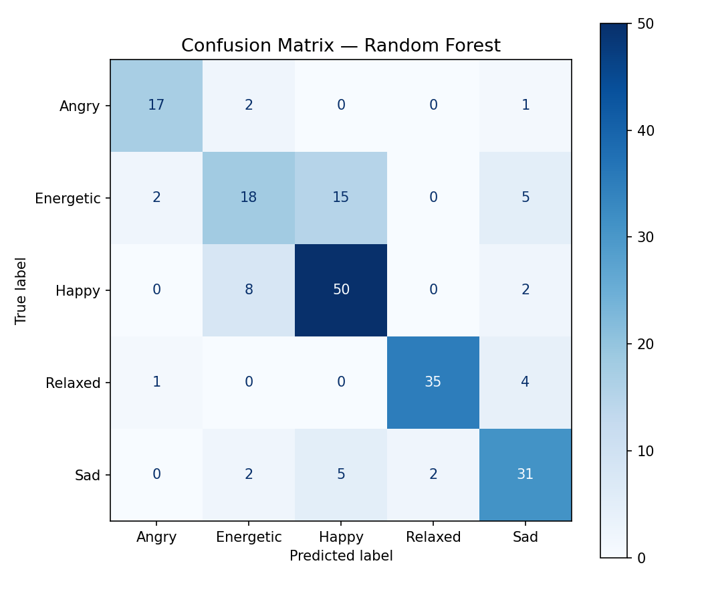

**Reading the numbers:**

| True → Predicted | Angry | Energetic | Happy | Relaxed | Sad | Correct |
|---|---|---|---|---|---|---|
| **Angry** | **17** | 2 | 0 | 0 | 1 | 85% |
| **Energetic** | 2 | **18** | 15 | 0 | 5 | 45% |
| **Happy** | 0 | 8 | **50** | 0 | 2 | 83% |
| **Relaxed** | 1 | 0 | 0 | **35** | 4 | 88% |
| **Sad** | 0 | 2 | 5 | 2 | **31** | 78% |

**Key observations:**

- **Random Forest does better on Angry (85% recall vs SVM's 60%):** With `class_weight="balanced"`, the forest's many trees vote strongly for Angry when metal-like features appear. Random Forest handles the class imbalance better than SVM here.

- **Energetic suffers badly (45% recall):** 15 out of 40 Energetic songs are misclassified as Happy. Rock songs and pop songs share many acoustic features — this is the hardest boundary in the dataset. This is Random Forest's biggest weakness.

- **Overall accuracy is lower than SVM (76%):** Despite doing better on Angry, Random Forest loses too many points on Energetic.

---

### 3.4 Confusion Matrix — XGBoost

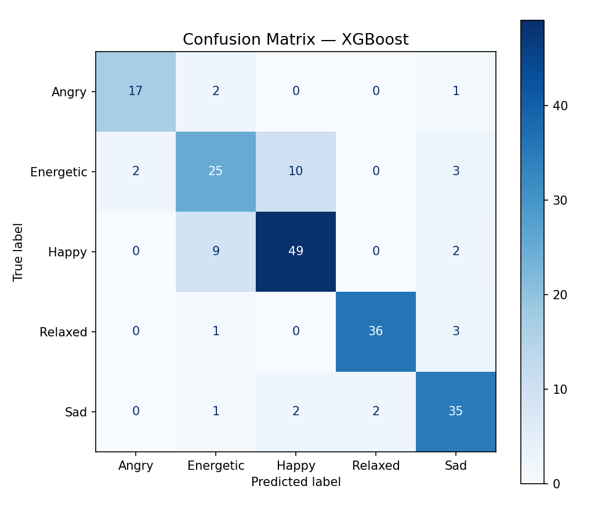

**Reading the numbers:**

| True → Predicted | Angry | Energetic | Happy | Relaxed | Sad | Correct |
|---|---|---|---|---|---|---|
| **Angry** | **17** | 2 | 0 | 0 | 1 | 85% |
| **Energetic** | 2 | **26** | 8 | 0 | 4 | 65% |
| **Happy** | 0 | 9 | **49** | 0 | 2 | 82% |
| **Relaxed** | 0 | 1 | 0 | **36** | 3 | 90% |
| **Sad** | 0 | 1 | 3 | 3 | **33** | 83% |

**Key observations:**

- **XGBoost achieves the best balance:** It matches Random Forest's Angry recall (85%) while recovering much of Energetic's recall (65% vs Random Forest's 45%).

- **The Energetic–Happy confusion is the persistent challenge:** Across all three models, rock and pop songs are the most commonly confused pair. This is expected — both are loud, fast, and bright. The difference is more about cultural genre conventions than acoustic properties.

- **Relaxed stays consistently well-predicted (90%)** across all three models — confirming that classical/jazz is acoustically the most distinct mood in the dataset.

- **XGBoost ROC-AUC: 0.961** — this measures how well the model ranks predictions. An AUC of 0.961 out of 1.0 means the model is extremely good at ordering songs by their probability of belonging to each mood, even when the final classification may be slightly off.

---

### 3.5 All Three Confusion Matrices Side by Side

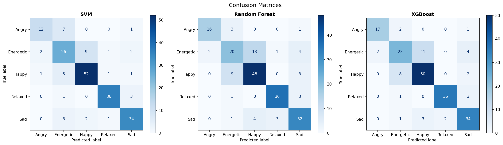

**What this is:** The three confusion matrices displayed together for direct comparison.

**What it reveals at a glance:**

- The diagonal (correct predictions) is darkest in all three models — good sign across the board.
- The SVM has a notably lighter Angry row (more misses on Angry).
- XGBoost and Random Forest have a brighter Angry diagonal cell, showing the tree-based models handle the minority class better with balanced weights.
- The Energetic row is the lightest (most misclassifications) in all three models — confirming that Energetic is the hardest mood to classify.
- All three models agree: Relaxed is the easiest mood; Energetic is the hardest.

---

### 3.6 Feature Importance — Random Forest (from model.py)

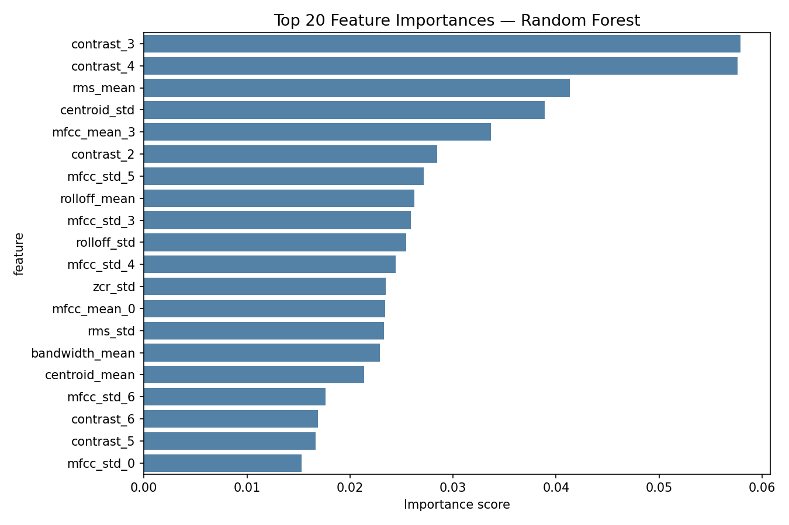

**What this is:** Random Forest tracks how much each feature reduces impurity (uncertainty) across all 300 decision trees. Features used near the top of many trees get high importance scores. This is called Gini importance.

**Top features and what they mean:**

| Rank | Feature | Importance | What it captures |
|---|---|---|---|
| 1 | contrast_4 | 0.071 | Spectral contrast in the 4th frequency band (mid-high) |
| 2 | contrast_3 | 0.060 | Spectral contrast in the 3rd frequency band (mid) |
| 3 | centroid_std | 0.040 | How much the brightness varies over time |
| 4 | contrast_2 | 0.039 | Spectral contrast in the 2nd frequency band |
| 5 | rms_mean | 0.039 | Average loudness |
| 6 | mfcc_mean_3 | 0.038 | 4th MFCC coefficient mean |

**What this tells us:**

- **Spectral contrast dominates**, confirming the ANOVA finding. The contrast features measure the "definition" of musical notes — metal is uniformly loud (low contrast), classical has clear notes against silence (high contrast). This is the single best discriminator between moods.

- **centroid_std (brightness variation)** is more important than centroid_mean — how much the brightness *changes* over time matters more than the average brightness level. Dynamic songs vary more; compressed pop stays constant.

- **rms_mean (loudness)** is in the top 5 — confirming that energy/loudness is a core signal for mood.

- **Tempo does not appear in the top 20** — consistent with our earlier findings that tempo alone is a poor mood discriminator.

---

### 3.7 Feature Importance — XGBoost (from model.py)

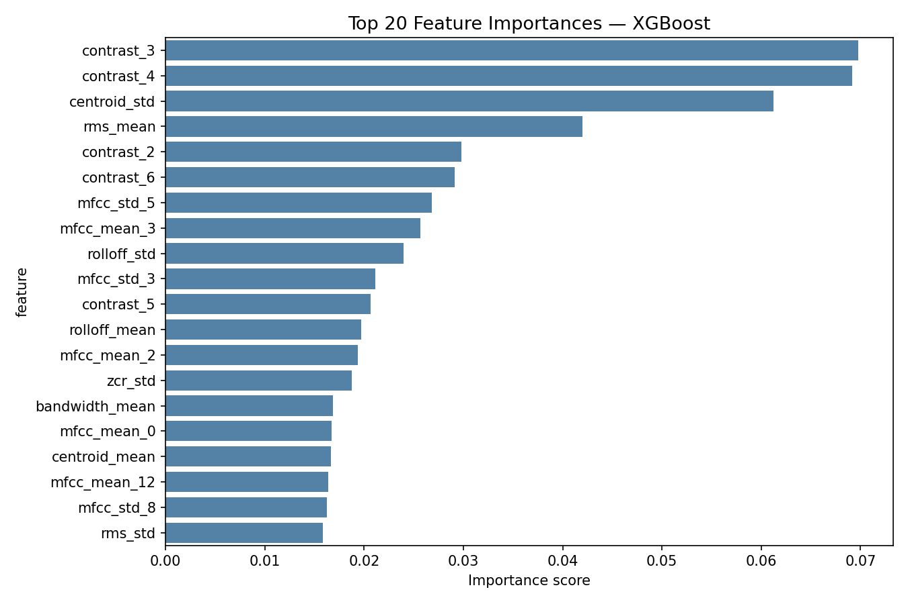

**What this is:** XGBoost's feature importance measures how often each feature is used to split data across all boosting rounds, weighted by how much each split improves the model.

**Top features:**

| Rank | Feature | Importance | Notes |
|---|---|---|---|
| 1 | contrast_4 | 0.083 | Same as Random Forest's #1 |
| 2 | contrast_3 | 0.075 | Same as Random Forest's #2 |
| 3 | centroid_std | 0.059 | Same as Random Forest's #3 |
| 4 | contrast_2 | 0.047 | Same as Random Forest's #4 |
| 5 | rms_mean | 0.042 | Same as Random Forest's #5 |
| 6 | rolloff_std | 0.026 | New entry — rolloff variation over time |

**Key observation:** The top 5 features are **identical** between Random Forest and XGBoost. When two completely different algorithms (one ensemble of independent trees, one sequential gradient boosting) agree on the same most important features, it is very strong evidence that those features are genuinely meaningful — not just artifacts of one model's quirks.

**rolloff_std** appears in XGBoost's top 6 but not Random Forest's — XGBoost places more emphasis on how much the spectral rolloff varies over time, which captures the difference between steady-state music (classical) and dynamically changing music (blues, rock).

---

### 3.8 Feature Importance — Random Forest (from notebooks)

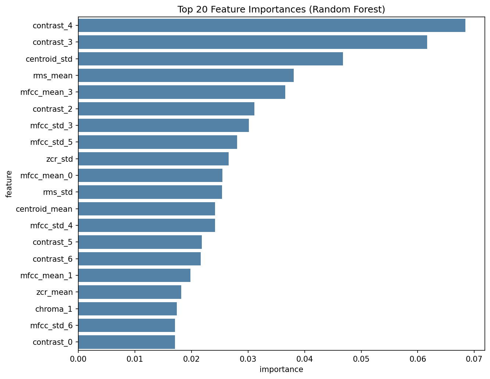

**What this is:** An earlier version of the feature importance plot generated in the notebooks during exploratory model training, before the final `model.py` pipeline was built.

**What it shows:** The same top features (contrast_4, contrast_3, centroid_std, rms_mean) but with slightly different importance scores due to using a different train/test split and random seed. The consistent agreement between this earlier run and the final model.py run confirms that the feature rankings are **stable and reproducible** — not dependent on a specific random split.

**Conclusion:** The fact that running the model multiple times with different splits consistently produces the same top features is strong evidence that the feature engineering was done correctly.

---

## Summary of Key Insights Across All Plots

| Question | Answer from Plots |
|---|---|
| Which features matter most? | Spectral contrast (bands 2–4), centroid_std, rms_mean — confirmed by ANOVA, Random Forest, and XGBoost |
| Which mood is easiest to classify? | Relaxed (classical/jazz) — most distinct cluster in t-SNE, highest precision across all models |
| Which mood is hardest to classify? | Energetic — overlaps heavily with Happy in PCA, t-SNE, and all confusion matrices |
| Are the features separating the classes? | Yes — t-SNE shows clear natural clusters, ANOVA confirms all 56 features are statistically significant |
| Which model performs best? | SVM (F1 = 0.811) overall, but XGBoost (F1 = 0.776) handles the Angry class better |
| Is the data balanced? | No — Angry has 100 samples vs Happy's 300, fixed with class_weight="balanced" |
| Does tempo help? | Barely — it doesn't appear in top 20 ANOVA or tree importances |
