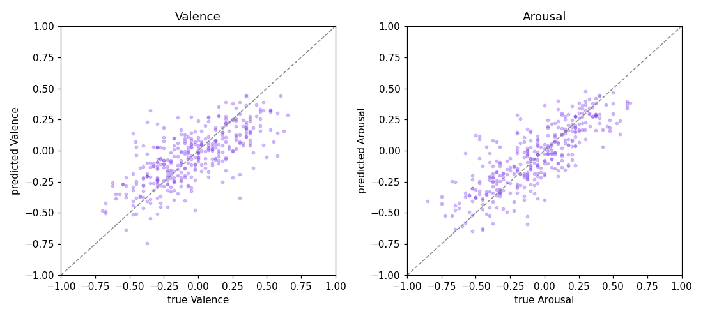
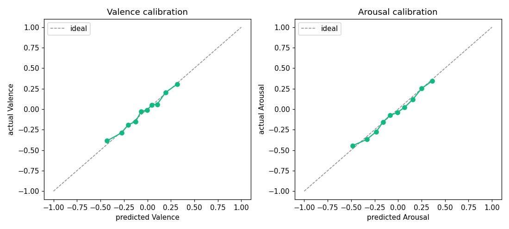
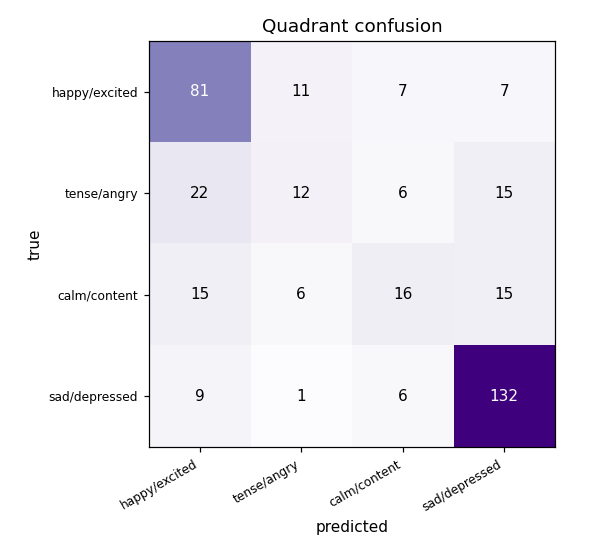

# MoodWave — a dimensional music-emotion engine

MoodWave reads the **emotion of a song** from its audio, places it on a continuous
2-D plane (valence × arousal), and uses that same representation to recommend
music that *feels* similar and to answer free-text "find me a vibe" queries.

This README is written for a technically literate reader. It states what the
system actually does, how the model is built, **what its measured accuracy is**,
and where it fails. Nothing here is aspirational — every number comes from the
held-out evaluation in [`artifacts/eval/metrics.json`](artifacts/eval/metrics.json),
reproducible via `python -m emotion.evaluate`.

---

## 1. Why dimensional, not a mood classifier

The original version was a single-label classifier (SVM/CNN over spectrogram
features → one of 5 moods). That framing is fundamentally lossy: emotion isn't
categorical. "Calm-happy" and "tense-happy" are both "happy" but acoustically and
affectively opposite, and a softmax forces a hard, often arbitrary, boundary.

MoodWave instead predicts a point in **Russell's circumplex** — two continuous
axes:

- **Valence** — unpleasant ↔ pleasant
- **Arousal** — calm ↔ energetic

The five product moods (Happy, Energetic, Angry, Sad, Relaxed) are kept only as
**named anchor points** in that plane, so the UI still speaks in moods while the
model reasons continuously. This makes the representation reusable: the same
vector drives classification, similarity recommendation, and cross-modal search.

```
            arousal +
                │   Energetic(0.3,0.8)
     Angry      │      Happy
   (-0.45,0.6)  │    (0.6,0.4)
 ───────────────┼─────────────── valence +
     Sad        │     Relaxed
   (-0.6,-0.5)  │    (0.55,-0.5)
                │
            arousal −
```

---

## 2. Architecture & data flow

```
audio (upload or 30s preview URL)
      │
      ▼
CLAP audio encoder  ──►  512-d embedding   (frozen, pretrained)
      │                        │
      │                        ├──► linear probe (RidgeCV)  ──► (valence, arousal)
      │                        │                                      │
      │                        │            zero-shot OOD gate ◄───────┤
      │                        │            (corrects aggressive audio) │
      │                        ▼                                       ▼
      │                  cosine search over 536-track corpus      nearest mood
      │                        │                                  + quadrant
      ▼                        ▼
 content-hash cache      "songs that feel like this"
```

The core design decision: **a frozen foundation model + a tiny trained head.**
We do not fine-tune CLAP. We treat it as a fixed feature extractor and train a
linear probe on top. This is cheap, reproducible on CPU, hard to overfit on a
small dataset, and — critically — keeps audio and text in the **same embedding
space**, which is what makes cross-modal search possible for free.

### The embedding (the part that matters most)
- **Model:** CLAP `laion/clap-htsat-unfused` (HTS-AT audio encoder + text encoder,
  contrastively aligned à la CLIP, but for audio↔text).
- **Pre-processing:** decode → mono → resample to **48 kHz** → split into
  **10-second chunks** → embed each chunk → **mean-pool** → **L2-normalise** →
  512-d unit vector. (See [`src/emotion/embed.py`](src/emotion/embed.py).)
- Per-chunk embeddings are also kept, so the serving path can measure how
  consistent the reading is across the clip (used for the confidence score).

### The head
- **`RidgeCV`** (L2-regularised linear regression, α chosen by CV) mapping
  512-d → 2 outputs (valence, arousal). Standardised inputs.
  See [`src/emotion/train_va.py`](src/emotion/train_va.py).
- Linear on purpose: with ~1.4k training clips, anything heavier overfits and
  buys nothing. The representational work is done by CLAP; the head only has to
  find the valence/arousal directions in that space.

---

## 3. Training data and measured performance

**Dataset:** [DEAM / MediaEval](https://cvml.unige.ch/databases/DEAM/) — 1 802
music clips with human valence/arousal annotations on a 1–9 scale. We map 1–9 →
[−1, 1]. Split: **1 441 train / 361 test**.

**Held-out results** (`artifacts/eval/metrics.json`):

| Axis | R² | MAE (norm) | MAE (1–9) | Variance ratio | Baseline R² (mean predictor) |
|------|-----|-----------|-----------|----------------|------------------------------|
| Valence | **0.493** | 0.162 | 0.65 | 0.75 | −0.008 |
| Arousal | **0.643** | 0.140 | 0.56 | 0.84 | −0.005 |

**Quadrant accuracy (4-way): 0.668.**

Read these honestly:

- **Arousal (R²=0.64) is reliably learnable; valence (R²=0.49) is harder.** This
  is the well-known asymmetry in music-emotion recognition — acoustic features
  carry energy/intensity strongly, but pleasantness is more cultural and
  context-dependent. We don't beat that; we report it.
- **Variance ratio < 1** means predictions are **compressed toward the mean**
  (regression to the mean): the model is conservative at the extremes,
  predicting ~75% of the true valence spread and ~84% of arousal. Visible in the
  calibration curve below.
- **Baseline R² ≈ 0** confirms a mean-predictor learns nothing, so the model's R²
  is real signal, not a label artefact.

### Where it's weak — the quadrant confusion (the honest part)

Per-quadrant recall, derived from the confusion matrix in the metrics file:

| True quadrant | Recall | Most common confusion |
|---|---|---|
| happy/excited | 76% | — |
| sad/depressed | 89% | — |
| **tense/angry** | **22%** | misread as **happy/excited** |
| calm/content | 31% | spread across neighbours |

The model is strong on the high-valence and low-everything corners but **weak on
negative-valence/high-arousal music (tense/angry)** — which it frequently
mislabels as happy/excited. The reason is the training distribution: DEAM is
mostly Western, fairly tame, royalty-free production music, with very little
aggressive material. The linear head therefore learned "loud + high-energy →
pleasant," which is true *in DEAM* and catastrophically wrong on metal/hardcore.

This is not a bug we hid; it's the single biggest known limitation, and it's why
§4 exists.

| Predicted vs actual | Calibration (regression to mean) | Quadrant confusion |
|---|---|---|
|  |  |  |

---

## 4. The out-of-distribution fix (confidence-gated zero-shot correction)

A real failure we hit: a death-metal track scored **91% "Happy."** Two problems —
the genre is out-of-distribution for the head, and the "91%" was a *consistency*
score, not a probability of correctness (see §5).

The fix exploits a property of CLAP that the regression head doesn't use: **CLAP
itself can tell aggressive music from happy music via zero-shot text similarity**,
because audio and text share a space. So at serve time we:

1. Score the clip against text anchors ("aggressive angry harsh screaming music",
   "heavy metal hardcore", vs "happy joyful cheerful"). This yields a zero-shot
   valence/arousal estimate and an **aggression score**.
2. Compute a **gate** ∈ [0,1] that is 0 for normal music and ramps to 1 only in
   the aggressive regime — anchored at the **90th–98th percentile** of DEAM's
   aggression distribution (fit once, stored in `va_calib.json`).
3. **Blend**: `final = (1 − gate)·head_prediction + gate·zero_shot_prior`.

Net effect: for ~90% of music the gate is ~0 and the accurate linear head is used
unchanged; only genuinely aggressive audio gets pulled toward its CLAP-derived
(correct) valence. Cost: ≈0.02 R² in-distribution, in exchange for eliminating the
worst-case error. Implementation: [`src/emotion/zero_shot.py`](src/emotion/zero_shot.py).

This is a **heuristic, not learned end-to-end** — an explicit, inspectable
guardrail. That's a deliberate trade: it's debuggable and can't silently regress
the in-distribution accuracy.

---

## 5. What "confidence" means (no overclaiming)

The percentage shown next to a result is **temporal consistency**, not
P(mood is correct):

```
consistency = 1 − (mean per-chunk std) / 0.6
confidence  = consistency · (1 − 0.3 · gate)
```

It answers "do the 10-second segments of this song agree with each other?" and is
discounted when the OOD gate fires. A song with a consistent emotional read scores
high; a song that swings between sections scores lower. We label it "Confidence"
in the UI for legibility but it is **not** a calibrated correctness probability,
and the code/comments say so.

---

## 6. Recommendations & cross-modal search

Both features are just **cosine similarity in the shared CLAP space** — no
separate recommender model.

- **"Songs that feel like this"** — the analysed clip's embedding vs a corpus of
  **536 tracks** (30-second iTunes previews, embedded with the identical
  pipeline). Top-k by cosine.
- **Browse by mood** — corpus tracks nearest a mood's anchor point.
- **Search by feeling** (cross-modal) — the user's text ("rainy sunday morning
  coffee") is embedded by **CLAP's text encoder** and matched against the same
  audio corpus. This works *only* because audio and text are co-embedded; there
  is no tagging or keyword lookup involved.

**Why in-memory cosine and not pgvector/FAISS?** 536 vectors × 512-d is ~1 MB; a
brute-force dot product is microseconds and has zero operational cost. A vector DB
here would be résumé-driven over-engineering. The corpus is small by choice
(de-duplicated, generic "production music" filtered out) to keep recommendation
quality high. See [`src/emotion/recommend.py`](src/emotion/recommend.py).

---

## 7. Continual learning (human-in-the-loop)

Every analysis is persisted **with its 512-d embedding**. Each result has a
confirm / correct control. That feedback becomes labelled training data:

- A confirmation → the predicted point is treated as a label.
- A correction → the chosen mood's anchor (or an explicit point) is the label.

[`backend/retrain_from_feedback.py`](backend/retrain_from_feedback.py) refits the
RidgeCV head on **DEAM + feedback**, with human labels **up-weighted 5×**, and
backs up the previous head. This is **batch** continual learning, run on demand /
on a schedule — not online learning. Important honesty: a handful of corrections
against 1 800 DEAM points moves a global linear model only slightly; the mechanism
is designed to shift the model as feedback **accumulates**, not to flip one song
instantly. (We removed an earlier per-song instant-override shortcut to keep the
learning path principled.)

---

## 8. Production-ML details that are easy to skip but matter

- **Content-hash embedding cache** — CLAP inference is the expensive step.
  Embeddings are cached by **SHA-256 of the audio bytes**
  ([`embed_audio_full_cached`](src/emotion/embed.py)), so re-analysing identical
  audio is ~instant and path-independent. Auto-invalidates when content changes.
- **Resumable offline jobs** — building the DEAM/corpus embeddings checkpoints
  every clip to disk atomically, so a crash or laptop sleep loses at most one
  item (learned the hard way after losing a 725-clip run).
- **Decode fallback** — librosa first, **PyAV** fallback for AAC/`.m4a` previews
  that libsndfile can't open.
- **Model artefacts shipped, training data not** — only the small serving files
  are committed (`va_head.joblib`, `va_calib.json`, the 536-track corpus
  `.npz`/meta, `metrics.json`); the bulky DEAM embeddings are git-ignored and
  rebuilt from the loader.

---

## 9. Stack

- **ML:** PyTorch, Hugging Face `transformers` (CLAP), scikit-learn (RidgeCV),
  librosa + PyAV, NumPy.
- **Backend:** FastAPI, SQLAlchemy, Postgres (auto-falls back to SQLite when
  `DATABASE_URL` is unset). Google sign-in via **ID-token verification** →
  app-issued **JWT** (no client secret, no Google People API).
- **Frontend:** React + Vite, Tailwind (CSS-variable theming, light/dark),
  framer-motion. Live typeahead search, valence/arousal circumplex, per-user
  history with confidence scores.

---

## 10. Honest limitations

1. **Valence is moderate (R²≈0.49)** and predictions regress toward the mean —
   extremes are under-called.
2. **Cultural/genre skew** — DEAM is small and Western-leaning; non-Western and
   aggressive genres are under-represented. The zero-shot gate patches the worst
   case (aggression) but is not a general fix for distribution shift.
3. **"Confidence" is consistency, not correctness** (§5).
4. **Recommendations are bounded by a 536-track corpus** — coverage, not the
   matching method, is the limit.
5. **Labels are subjective** — DEAM annotations are averaged human ratings; there
   is irreducible disagreement, which caps achievable R².
6. **The head is linear and the OOD correction is heuristic** — deliberate choices
   favouring reproducibility and inspectability over squeezing the last few points.

---

## 11. Running it

```bash
# Backend
cd backend
pip install -r requirements.txt
# optional: set DATABASE_URL (else SQLite). GOOGLE_CLIENT_ID/SECRET_KEY for auth.
uvicorn main:app --reload --port 10000

# Frontend
cd frontend
npm install
npm run dev            # http://localhost:5173

# Reproduce the model + metrics
python -m emotion.train_va        # trains the RidgeCV head
python -m emotion.evaluate        # writes artifacts/eval/metrics.json + figures
python backend/retrain_from_feedback.py   # fold in user feedback
```

See [`MODEL_CARD.md`](MODEL_CARD.md) for the formal model card and
[`frontend/DESIGN_SYSTEM.md`](frontend/DESIGN_SYSTEM.md) for the UI design system.
